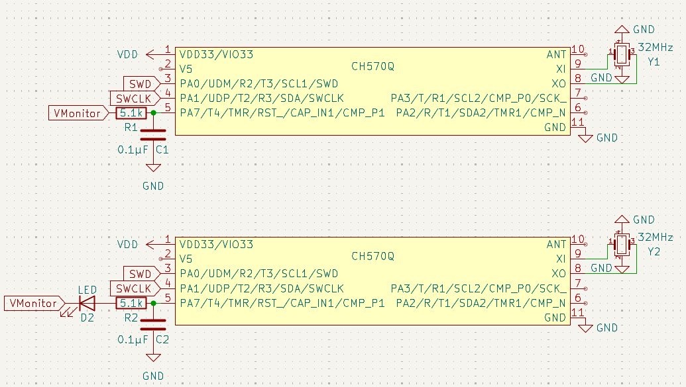

# Slow ADC on CH57x using the comparator

This leverages the ch570/572's comparator to create a virtual ADC. It uses integration time over a capacitor in order to measure a voltage.

This demo leverages the connection between the comparator and TMR1.  This allows you to get extremely precise timestamps on when an edge occurred.

This operates by clamping the voltage on the pin (PA4 or PA7) low, then timing the amount of time it takes to rise to a threshold.

This does put a practical bottom limit on the voltage that can be measured just above the reference voltage, without switching designs.  But there is no direct limit on the maximum voltage that can be read.  I've tested this setup to about 24VDC, with a 5.1k charge resistor.

One other convenient thing is you can dual-purpose this pin and add an LED.  This way you can illumiunate the LED but also measure the voltage after the LED Vf drop.  This is ideal for a battery solution where you only need to spend one GPIO to monitor battery voltage and light an LED.

**NOTE:** The measurement is EXTREMELY sensitive to the capacitance and you should calibrate.  Capacitance changes over temperature.
**NOTE:** You can only measure voltages from just over the reference or higher. Practical limits are in the range of 20ish volts.

The general approach is:

1. Ground the pin.
2. Release the pin.  The voltage will charge the capacitor.
3. The voltage can be measured by counting the time it takes for the capacitor to reach the threshold.
4. Compute the voltage from the inverse RC charge equation.

